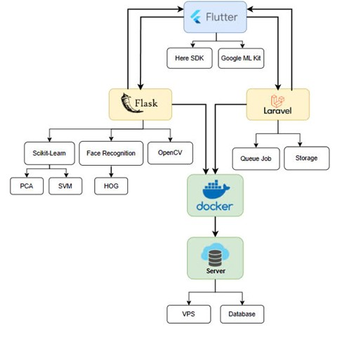

# 📱 Mobile Attendance App with Face Recognition and Location Tracking

This project is a Mobile Attendance System built using Flutter, integrated with facial recognition and location verification to provide a modern, secure, and accurate solution for employee time tracking.

## 📌 Overview

This application helps companies prevent time fraud such as buddy punching and ensures employees are physically present at the designated location before clocking in or out. It combines face recognition, GPS location verification, and centralized attendance reporting.

## 🚀 Technologies Used

### Frontend
- Flutter
- HERE SDK (for location tracking)
- Google ML Kit (face detection)

### Backend
- Laravel (API and database handling)
- Flask (face recognition server using Python)
- MySQL (database)
- Docker (containerization)

### AI & Tools
- face_recognition (Python library)
- OpenCV
- Postman, Firebase, Git

## ⚙️ Main Features

- 🔐 Face-based clock-in/out
- 📍 Location-based attendance validation
- 👥 Employee and company management
- 📊 Attendance reports for users and admins
- 🗂️ Admin panel for managing staff and schedules
- 📤 Export reports in custom date ranges
- 📱 Responsive and user-friendly UI

## 📈 Functional Flow

1. User Login
2. Face Setup (initial registration)
3. Attendance Check (face + GPS validation)
4. View Personal Reports
5. Manager Functions: Create/Manage Employees, Set Work Coordinates & Hours
6. Admin Functions: Manage Companies & Admin Accounts

